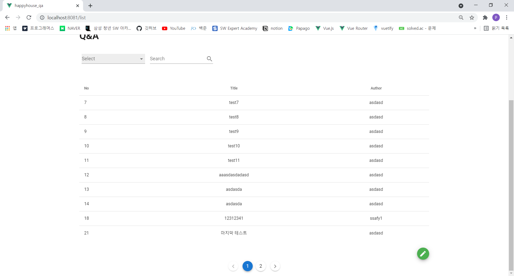
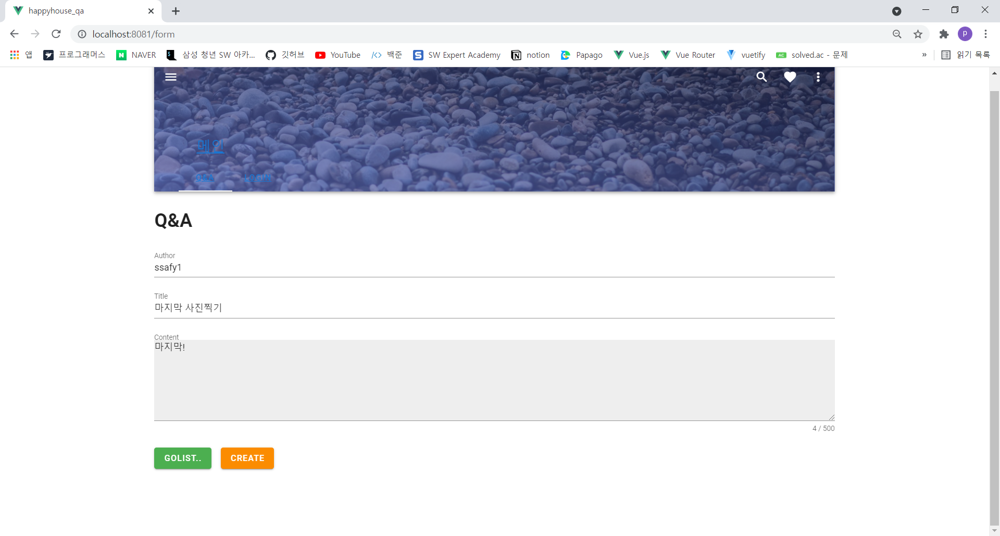
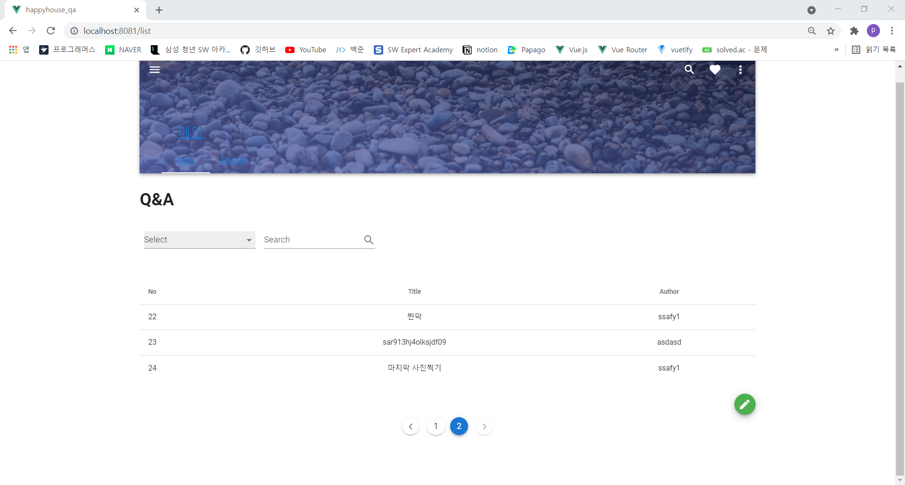
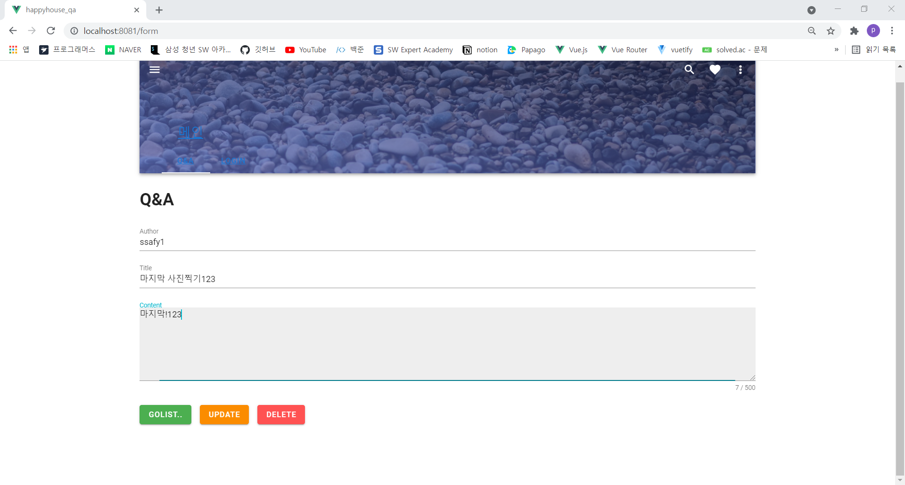
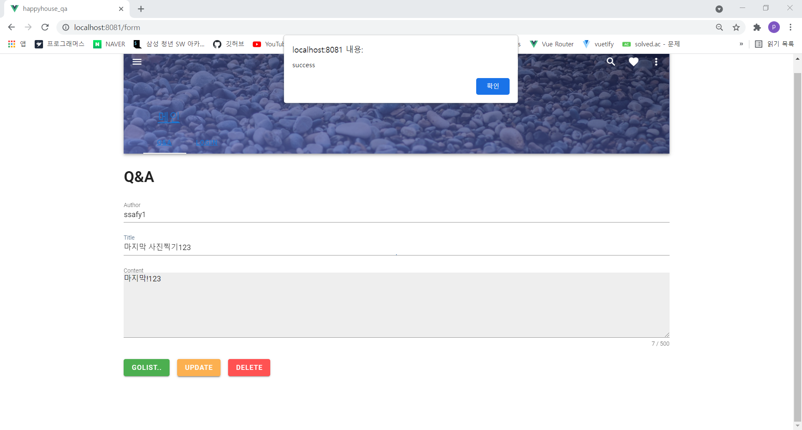
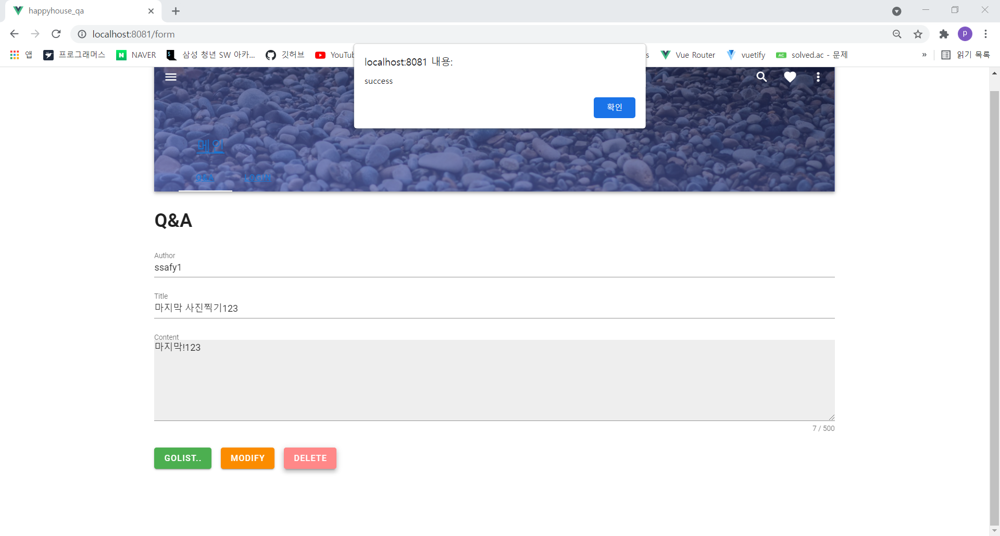
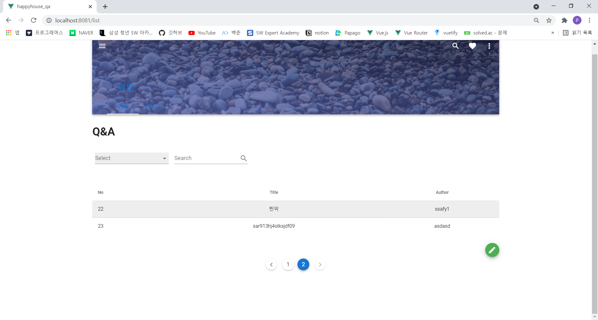

# Vue프로젝트

> Q&A 게시판 제작 --> 백엔드(스프링 부트)와 프론트엔드(Vue)

 

### 처리된 요구사항 목록

|난이도|구현기능(DB 구축 및 연결)|세부|작성여부(O/X)|
|:---:|---|---|:---:|
|기본|Vue를 적용한 FrontEnd|QnA 목록|O|
|기본|Vue를 적용한 FrontEnd|QnA 등록|O|
|기본|Vue를 적용한 FrontEnd|QnA 수정|O|
|기본|Vue를 적용한 FrontEnd|QnA 상세조회|O|
|기본|Backend 서버측 구현|QnA 목록|O|
|기본|Backend 서버측 구현|QnA 등록|O|
|기본|Backend 서버측 구현|QnA 삭제|O|
|기본|Backend 서버측 구현|QnA 수정|O|
|기본|Backend 서버측 구현|QnA 상세조회|O|
|추가|동네 업종 정보 조회|X|
|추가|동네 환경 점검 정보 조회|X|
|심화|메인페이지 or 추가 기능|X|

* 작성된 기능은 반드시 캡쳐되어야 합니다. 
* 추가로 구현한 기능을 표에 추가시키세요.

### 실행화면 캡쳐 -
TODO: 요구사항 목록에서 완료 처리된 사항의 캡쳐 이미지를 등록하세요.

구현 기능: 전체 프로그램 동작/오류 없이 전체 동작 1

#### 1.구현 기능: BackEnd(Controller)

#### 2. 구현 기능: BackEnd(Dao)

#### 3.구현 기능: BackEnd(Service)

#### 4. 구현 기능: BackEnd(Dto)

#### 5. 구현 기능: BackEnd(Mapper)

#### 6. 구현 기능: FrontEnd(QnA 목록)

#### 7. 구현 기능: FrontEnd(QnA 등록)

#### 8. 구현 기능: FrontEnd(QnA 등록 결과)

#### 9. 구현 기능: FrontEnd(QnA 조회)

#### 10. 구현 기능: FrontEnd(QnA 수정)

#### 11. 구현 기능: FrontEnd(QnA 수정결과)

#### 12. 구현 기능: FrontEnd(QnA 삭제)

#### 12. 구현 기능: FrontEnd(QnA 삭제결과)

### 소감

+ 장정훈
  + 스프링 부트와 Vue로 백엔드와 프론트엔드를 완벽히 구분지어 작업해볼 수 있는 기회였습니다.
  + Bootstrap-Vue보다 더 심플하고 많이 사용해본 디자인과 닮아 보여 Vuetify를 사용해보았습니다.
  + 스프링 부트를 이용한 작업은 많이 해봐서 그런지 자잘한 오류 외에는 금방 작업할 수 있었습니다.
  + 하지만, Vue, Vuex, Vuetify 등 프론트엔드 프레임워크를 처음 사용하다보니 실수가 있었던 것 같습니다.
  + 프로젝트에 들어가기 전 Vue를 이용한 프론트엔드 작업을 여러번 해봐서 어렵진 않았던 것 같습니다.
  + 기존 JSP를 사용했던 환경에서 넘어오니 낯설고 고려할 점이 많았지만, Vue를 이용하면서 컴포넌트의 재활용성이 좋아졌던 것 같습니다.
  + 백엔드와 프론트엔드를 나누면서 생기는 작업이 완벽히 분리된다는 이점을 느낄 수 있었습니다.
  + JSP에서 Vue로 넘어오면서 세션에 대한 개념이 사라져서 로그인과 같이 세션에 정보를 담기 위해 JWT와 토큰에 대해 공부해보고자 합니다.
