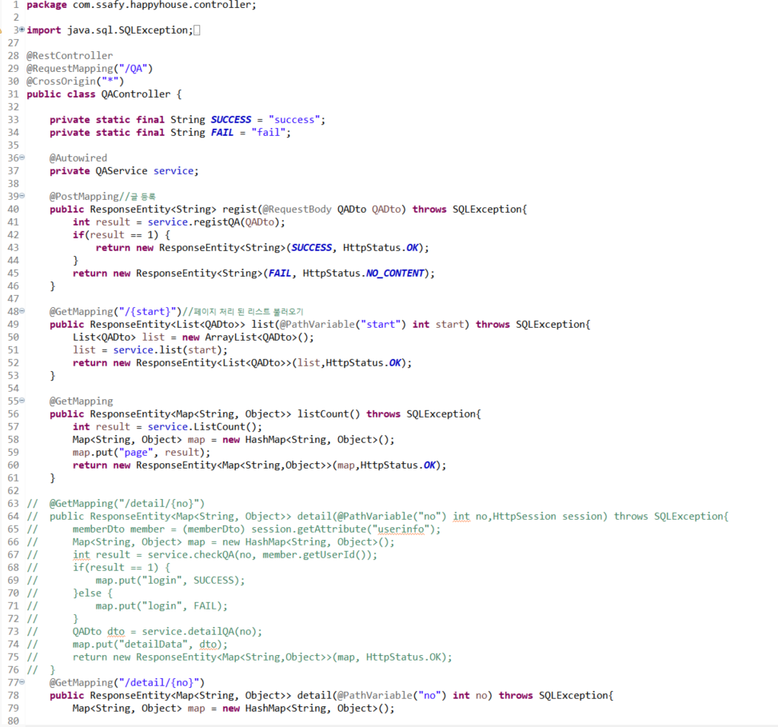
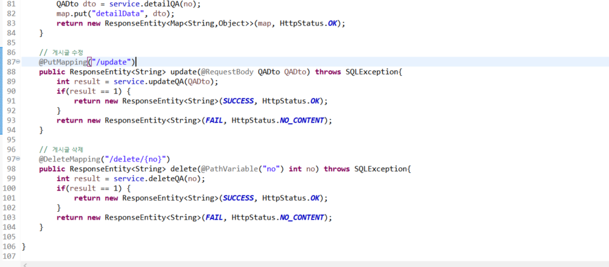
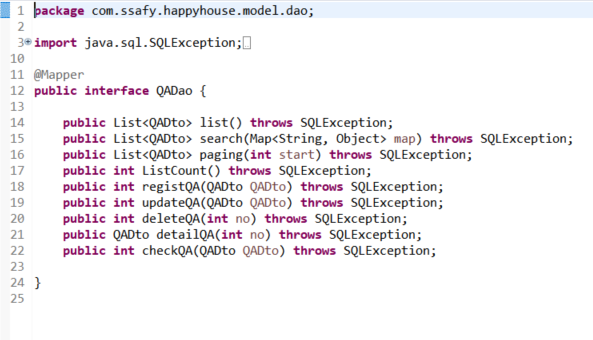
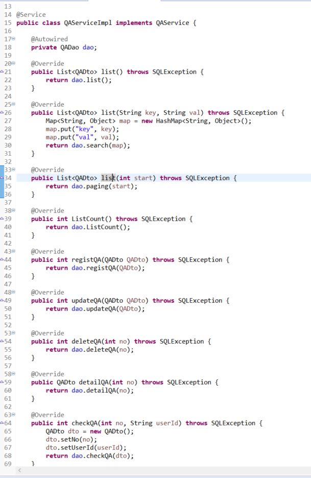
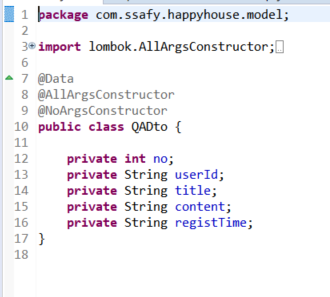
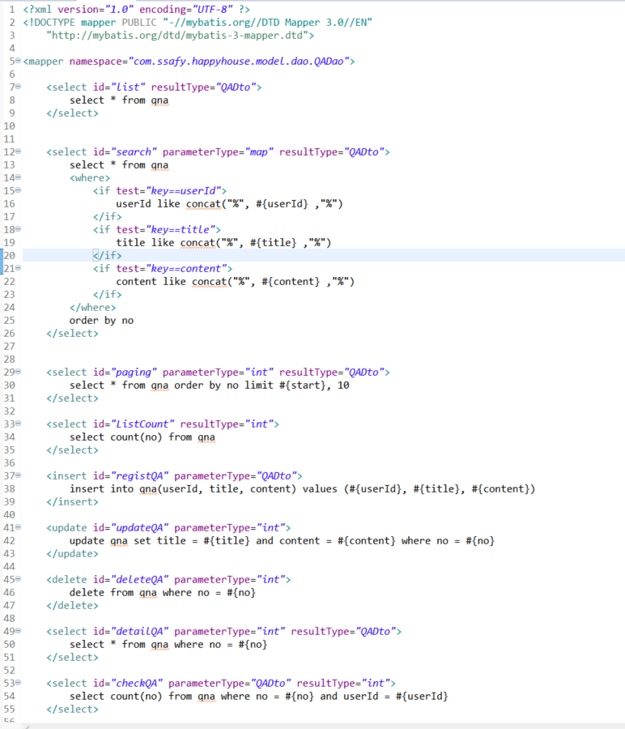

관통 프로젝트 제출 방법

# 관통프로젝트: HappyHouse_Vue_Front_KJ_05_JJH_HSJ
# 관통프로젝트: HappyHouse_Vue_Backend_KJ_05_JJH_HSJ
# README.md는 front에 작성

### 제출일: 2021.11.17

### 참여 페어
- 장정훈(조장), 황선주

### 처리된 요구사항 목록

|난이도|구현기능(DB 구축 및 연결)|세부|작성여부(O/X)|
|:---:|---|---|:---:|
|기본|Vue를 적용한 FrontEnd|QnA 목록|O|
|기본|Vue를 적용한 FrontEnd|QnA 등록|O|
|기본|Vue를 적용한 FrontEnd|QnA 수정|O|
|기본|Vue를 적용한 FrontEnd|QnA 상세조회|O|
|기본|Backend 서버측 구현|QnA 목록|O|
|기본|Backend 서버측 구현|QnA 등록|O|
|기본|Backend 서버측 구현|QnA 삭제|O|
|기본|Backend 서버측 구현|QnA 수정|O|
|기본|Backend 서버측 구현|QnA 상세조회|O|
|추가|동네 업종 정보 조회|X|
|추가|동네 환경 점검 정보 조회|X|
|심화|메인페이지 or 추가 기능|X|

* 작성된 기능은 반드시 캡쳐되어야 합니다. 
* 추가로 구현한 기능을 표에 추가시키세요.

### 실행화면 캡쳐 -
TODO: 요구사항 목록에서 완료 처리된 사항의 캡쳐 이미지를 등록하세요.

구현 기능: 전체 프로그램 동작/오류 없이 전체 동작 1

#### 1.구현 기능: BackEnd(Controller)

#### 2. 구현 기능: BackEnd(Dao)

#### 3.구현 기능: BackEnd(Service)

#### 4. 구현 기능: BackEnd(Dto)

#### 5. 구현 기능: BackEnd(Mapper)

#### 6. 구현 기능: FrontEnd(QnA 목록)

#### 7. 구현 기능: FrontEnd(QnA 등록)

#### 8. 구현 기능: FrontEnd(QnA 등록 결과)

#### 9. 구현 기능: FrontEnd(QnA 조회)

#### 10. 구현 기능: FrontEnd(QnA 수정)

#### 11. 구현 기능: FrontEnd(QnA 수정결과)

#### 12. 구현 기능: FrontEnd(QnA 삭제)

#### 12. 구현 기능: FrontEnd(QnA 삭제결과)

### 소감

+ 장정훈
  + 스프링 부트와 Vue로 백엔드와 프론트엔드를 완벽히 구분지어 작업해볼 수 있는 기회였습니다.
  + Bootstrap-Vue보다 더 심플하고 많이 사용해본 디자인과 닮아 보여 Vuetify를 사용해보았습니다.
  + 스프링 부트를 이용한 작업은 많이 해봐서 그런지 자잘한 오류 외에는 금방 작업할 수 있었습니다.
  + 하지만, Vue, Vuex, Vuetify 등 프론트엔드 프레임워크를 처음 사용하다보니 실수가 있었던 것 같습니다.
  + 프로젝트에 들어가기 전 Vue를 이용한 프론트엔드 작업을 여러번 해봐서 어렵진 않았던 것 같습니다.
  + 기존 JSP를 사용했던 환경에서 넘어오니 낯설고 고려할 점이 많았지만, Vue를 이용하면서 컴포넌트의 재활용성이 좋아졌던 것 같습니다.
  + 백엔드와 프론트엔드를 나누면서 생기는 작업이 완벽히 분리된다는 이점을 느낄 수 있었습니다.
  + JSP에서 Vue로 넘어오면서 세션에 대한 개념이 사라져서 로그인과 같이 세션에 정보를 담기 위해 JWT와 토큰에 대해 공부해보고자 합니다.

+ 황선주
  Spring과 Vue를 이용하여 QnA 기능들을 구현한 프로젝트로 백엔드와 프론트가 연동되는 로직에 대해서 다시한번 학습하게되었다. 이전 프로젝트와 달리 프론트와 백엔드를 구분해둠으로써 구현하는데 있어서 훨씬 편리했다. 오류 뿐만이 아니라 구현하는데 있어서 부족한 부분들을 빠르게 파악할 수 있어서 그렇다고 느낀 것 같다. 프론트에서 이번엔 vuetify를 처음 사용해봤는데 bootstrap-vue와 큰 차이를 못느낄정도로 다르진않았다. 워낙 관련 문서들이 잘 구성되어 있어서 쉽게 사용할 수 있었다. 백엔드에서는 키워드를 통해 리스트 정보를 조회하는 기능을 구현하지 못해 아쉬웠다. map을 이용한 rest서비스 구현에 대한 학습이 더 필요하다고 느꼈다.
